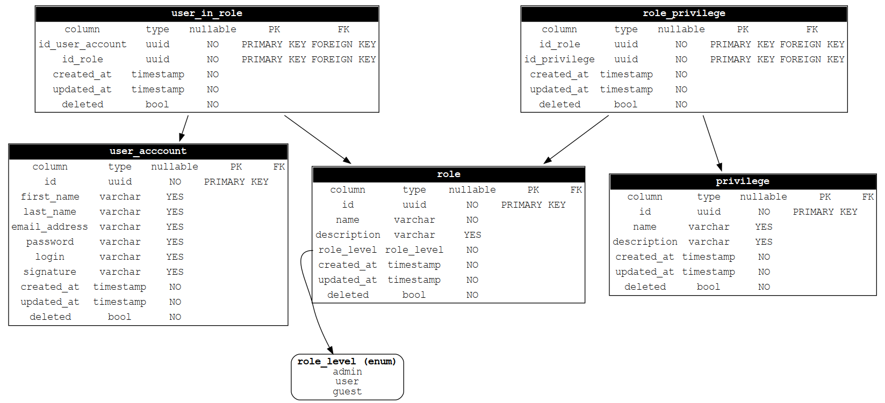

schema
=======

generate erm like database schema from postgresql db

    ./schema.sh | dot -Tpng > schema.png

* `-u|--user` database user (default: `postgres`)
* `-d|--database` database name (default: `postgres`)
* `-s|--schema` database schema (default: `public`)

## requirements

* PostgreSQL must be up and running
* `dot` must be installed (see [graphviz](https://www.graphviz.org/) for further reading)

## sample

When you take the generated tables from my [database init scripts][dbinit], you get 

as a result.

Contact
-------

Jan Frederik Hake, <jan_hake@gmx.de>. [@enter_haken](https://twitter.com/enter_haken) on Twitter.

[dbinit]: https://github.com/enter-haken/scripts/blob/master/db_init.sh#L103
